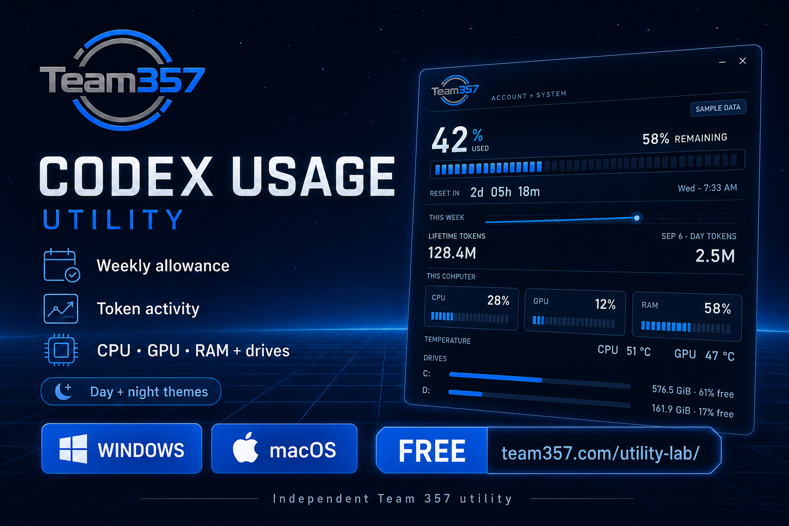

# Team 357 Codex Usage Utility

A free desktop dashboard for people who use Codex. It keeps the weekly allowance, reset countdown, token activity, and computer health visible in one compact utility.

[Download from Team 357](https://team357.com/utility-lab/) · [Report a bug](https://github.com/Theoldway007/team357-codex-usage-utility/issues/new?template=bug-report.yml) · [Request a feature](https://github.com/Theoldway007/team357-codex-usage-utility/issues/new?template=feature-request.yml)

## Downloads

| Platform | Current version | Package |
| --- | ---: | --- |
| Windows 10/11, 64-bit | 0.4.16 | [Setup or portable ZIP](https://github.com/Theoldway007/team357-codex-usage-utility/releases/tag/desktop-2026.09.10) |
| macOS 13 or later, Apple silicon and Intel | 0.6.0 | [Universal Mac app ZIP](https://github.com/Theoldway007/team357-codex-usage-utility/releases/tag/desktop-2026.09.10) |

The Team 357 Utility Lab remains the primary product page and update source. GitHub Releases provides a second download location, version history, checksums, and community feedback.

## What it shows

- Codex weekly usage and remaining allowance
- Service-reported reset date and live countdown
- A local seven-day history graph with reset and gap handling
- Lifetime and latest-day token activity when the account supplies it
- Computer health: CPU, physical memory, and ready drives
- On Windows, GPU usage and supported temperatures, with clickable drive rows
- Full and mini views, day and night themes, and optional always-on-top behavior

The Windows dashboard refreshes account data once per minute, token activity every five minutes, computer gauges every five seconds, and drives and temperatures every 30 seconds. Windows hardware polling pauses while the utility is hidden, and the mini view pauses decorative and hardware work. Available hardware readings differ between Windows and macOS; the promotional image shows the Windows layout with sample data.

## Connect your Codex account

Install the official Codex desktop app and sign in there. The utility uses Codex's locally managed session through the compatible Codex app server. It does not ask for your password, copy authentication files, read browser cookies, or require you to paste a token.

A browser-only ChatGPT login is not enough. If the session is missing or expired, open **Settings**, select **Retry connection**, and use **Sign in in browser** only if Codex requests it.

## Install on Windows

1. Download `Team357-Codex-Usage-Utility-Setup-0.4.16.exe` from the Windows release.
2. Open Setup in File Explorer.
3. Choose whether to create a desktop shortcut, then select **Install**.
4. Close Setup and open the blue Team 357 utility shortcut.

The portable ZIP can be extracted to a writable folder and run without Setup. Windows builds are currently unsigned, so Microsoft Defender SmartScreen or a browser may show an unknown-publisher or uncommon-download warning. GitHub hosting does not remove that warning. Keep your normal security protections enabled and compare the SHA-256 checksum before opening the file.

## Install on macOS

1. Download `Team357-Codex-Usage-Utility-Mac-0.6.0-App-Only.zip` from the Mac release.
2. Expand it in Finder and open `Team357 Codex Usage Utility.app`.
3. Choose **Install and Open**. A Desktop alias is optional.

The current Mac build is ad-hoc signed and is not Apple notarized. First launch may require approval, and managed Macs may block it. Runtime testing was completed on an Apple M4 Mac with macOS 15.7.3; Intel hardware and macOS 13 remain community test targets.

## Updates and removal

Both apps include a manual **Check for updates** control. Verified updates come from the fixed Team 357 download feed over HTTPS. Nothing installs silently. Windows downloads are checked against the published byte count and SHA-256; Mac downloads use the separate Mac feed and are shown in Finder for normal installation.

Both apps have an uninstall control. Preferences and the bounded local usage history are kept unless you explicitly choose to remove them.

## Privacy and trust

The utility has no advertising, tracking pixel, remote-control service, or telemetry upload. Team 357 does not receive your account readings, usage percentage, tokens, drive contents, or computer-health readings. The utility never reads conversation text or document contents. See [PRIVACY.md](PRIVACY.md) for the complete behavior.

Release hashes are in [CHECKSUMS.txt](CHECKSUMS.txt). Security reports should follow [SECURITY.md](SECURITY.md).

## Repository status

This is the official download and support repository. It contains release binaries and public documentation. Application source is not included, and this project is not currently offered under an open-source license. GitHub's automatically generated source archives contain the repository documents; download the named Windows or Mac package to install the utility.

The compiled utility is free to use under the [Team 357 Free Use License](LICENSE.md). Bug reports, hardware compatibility reports, and feature ideas are welcome. See [CONTRIBUTING.md](CONTRIBUTING.md).

Team 357 is independent of OpenAI. Codex and ChatGPT are trademarks of their respective owner. No affiliation with or endorsement by OpenAI is implied.
